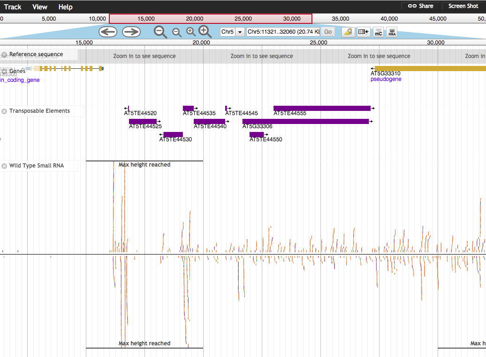

[](https://travis-ci.org/bhofmei/jbplugin-smallrna)

# Small RNA Plugin

JBrowse plugin to support small RNA visualization

The original plugin by Brigette Hofmeister is at [https://github.com/bhofmei/jbplugin-smallrna](https://github.com/bhofmei/jbplugin-smallrna)

The citation is Enhanced JBrowse plugins for epigenomics data visualization Brigitte T. Hofmeister, Robert J. Schmitz BMC Bioinformatics 19(159); doi: 10.1186/s12859-018-2160-z

This is a fork created by Mike Axtell to change some details of display and get compatibility with ShortStack's definition of multimapping reads. Please cite Brigitte's paper above.

## Mike Axtell's changes

I've forked the original plugin to modify it to suit my own preferences as far as display, and for
compatibility with ShortStack's method of designating multimapping reads. 

Based on the JBrowse tack type "Alignments2", the small RNA alignments track shows individual reads. The differences are:

1.  Reads are colored by size not strand  
2.  Reads can be filtered by size and/or multimapping  -- disabled in this fork.
3.  There is animal and plant specific coloring because plant's don't have piRNAs. Plant coloring is the default. --coloring scheme is changed in this fork, see below.
4.  Reads are organized on a y-axis by strand with positive-strand reads above the y-axis origin and negative-strand reads below it.


## Install

For JBrowse 1.11.6+ in the _JBrowse/plugins_ folder, type:  
``git clone https://github.com/bhofmei/jbplugin-smallrna.git SmallRNAPlugin``

**or**

downloaded the latest release version at [releases](https://github.com/bhofmei/jbplugin-smallrna/releases).  
Unzip the downloaded folder, place in _JBrowse/plugins_, and rename the folder _SmallRNAPlugin_

## Activate
Add this to _jbrowse.conf_ under `[GENERAL]`:

    [ plugins.SmallRNAPlugin ]
    location = plugins/SmallRNAPlugin

If that doesn't work, add this to _jbrowse_conf_.json:

    "plugins" : {
        "SmallRNAPlugin" : { "location" : "plugins/SmallRNAPlugin" }
    }
    
## Test

Sample data is included in the plugin to test that the plugin is working properly. With `URL` as the URL path to the JBrowse instance, navigate a web browser to `URL/index.html?data=plugins/SmallRNAPlugin/test/data`.



## The Basics - modified by MJA for this fork
- Each read is colored based on length
  - skyblue: 20 nt
  - blue: 21 nt
  - mediumseagreen: 22 nt
  - orange: 23 nt
  - tomato: 24 nt
  - gray: all other sizes
  - colors were chosen to fit ShortStack's size range, and to be color-blind compatible.
  
- Reads are positions positions based on strand
  - Above y-axis origin: positive strand
  - Below y-axis origin: negative strand
- Unfilled reads indicate read maps to multiple locations
- Filtering options -- disabled in this fork

## Plants vs Animals
- disabled in this fork

## Using small RNA Tracks
### File Formats
Reads are read directly from a BAM file. Follow the instructions for the Alignments2 track to specify the file location.  
Also, make sure the indexed BAM file (`.bam.bai`) is in the same directory as the BAM file.
Optionally, you can also supply a BigWig file for coverage view when zoomed out. I recommend this. Otherwise the track says "Too much data to show; zoom in to see detail"

In this fork, ShortStack-created BAM files are recognized.

### JSON Track Specifications
Track specifications are similar to the Alignments2 specifications. The _label_, _type_, and _urlTemplate_ must be specified. Take note of _type_; this is the difference from Alignments2.

To change the plant or animal coloring scheme, for the specific track, include the _isAnimal_ setting. Otherwise it assumes the setting based on the priority list above.

In trackList.json,

```
{
    "key" : "Small RNA",
    "label" : "smrna",
    "storeClass" : "JBrowse/Store/SeqFeature/BAM",
    "urlTemplate" : "path/to/smallrna.bam",
    "type" : "SmallRNAPlugin/View/Track/smAlignments"
}
```

In tracks.conf,

    [tracks.smrna]
    key = Small RNA
    storeClass = JBrowse/Store/SeqFeature/BAM
    urlTemplate = path/to/smallrna.bam
    type = SmallRNAPlugin/View/Track/smAlignments

Similar to other alignments, you can specify a BigWig file to use for the histogram view.

In trackList.json,

```
{
    "key" : "Small RNA",
    "label" : "smrna",
    "storeClass" : "JBrowse/Store/SeqFeature/BAM",
    "urlTemplate" : "path/to/smallrna.bam",
    "type" : "SmallRNAPlugin/View/Track/smAlignments",
    "histograms" : {
        "storeClass" : "JBrowse/Store/SeqFeature/BigWig",
        "urlTemplate" : "path/to/smallrna.bw"
    }
}
```

### HTML Features-style Track
The track type `smAlignments` is preferred for its speed, but HTMLFeature alignments track is available. 
It is comparable to JBrowse's Alignments track.

This track type is beneficial when taking PDF/SVG screenshots so each read is an HTML element (compared to being painted on the canvas for smAlignments/Alignments2).

Track configurations are the same except the track type and it does not accept a BigWig file for histograms.

In _tracks.conf_,
```
[tracks.smrna-html]
key = Small RNA - HTML
storeClass = JBrowse/Store/SeqFeature/BAM
urlTemplate = path/to/smallrna.bam
type = SmallRNAPlugin/View/Track/smHTMLAlignments
```

In _trackList.json_,
```
{
  "key" : "Small RNA - HTML",
  "label" : "smrna-html",
  "storeClass" : "JBrowse/Store/SeqFeature/BAM",
  "urlTemplate" : "path/to/smallrna.bam",
  "type" : "SmallRNAPlugin/View/Track/smHTMLAlignments",
}
```


## Multimapping
Traditionally, for small RNA analysis is important to know if a read maps uniquely or multiple times within the genome. In this plugin, multi-mapped reads are shown in the appropriate color for the length, but are more transparent.  

In this fork, multimapped reads are recognized via the XX:i tag added by ShortStack to indicate multi-mapping.

filtering of multipmapped reads has been disabled, due to my preferences.

## Quality Filtering
- disabled in this fork.

